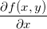
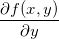

# 关键术语

监督学习
 + 分类
 + 回归：预测数值型数据

 监督学习一般使用两种类型的目标变量：**标称型**和**数值型**

 将属性称为**特征**

 将分类问题中的目标变量称为**类别**

 特征或属性通常是训练样本集的列，它们是独立测量得到的结果，多个特征联系在一起共同组成一个训练样本

 为了测试机器学习算法的效果，通常使用两套独立的样本集：**训练数据**和**测试数据**。当机器学习开始运行时，使用训练样本集作为算法的输入，训练完成之后输入测试样本。输入测试样本时并不提供测试样本的目标变量，由程序决定样本属于哪个类别。比较测试样本预测的目标变量值与实际样本类别之间的差别，就可以得出算法的实际精确度。


# 机器学习的主要任务

 用于执行分类、回归、聚类和密度估计的机器学习算法

 监督学习的用途

| &nbsp;  | &nbsp;         |
| ------- | -------------- |
| k-近邻算法  | 线性回归           |
| 朴素贝叶斯算法 | 局部加权线性回归       |
| 支持向量机   | Ridge 回归       |
| 决策树     | Lasso 最小回归系数估计 |

 无监督学习的用途

| &nbsp; | &nbsp;     |
| ------ | ---------- |
| k-均值   | 最大期望算法     |
| DBSCAN | Parzen 窗设计 |


# 如何选择合适的算法

 需要考虑如下两个问题：

  + 使用机器学习算法的目的，想要算法完成何种任务
  + 需要分析或收集的数据是什么


 使用机器学习算法的目的

  + 想要预测目标变量的值：**监督学习算法**

     - 离散型目标变量 : **分类算法**
       - 连续型目标变量 : **回归算法**

  + 不想预测目标变量的值：**无监督学习算法**

    - 是否需要将数据划分为离散的组

       * 是。**聚类算法**
       * 还需要估计数据与每个分组的相似程度。**密度估计算法**


还需要考虑数据问题。应了解数据的以下特性：

  + 特征值是离散型变量还是连续型变量
  + 特征值中是否存在缺失的值，何种原因造成缺失值
  + 数据中是否存在异常值，某个特征发生的频率如何
  + ... ...


# 开发机器学习应用程序的步骤

 + 收集数据。使用很多方法收集样本数据
 + 准备输入数据。
 + 分析输入数据。确保数据中没有垃圾数据
 + 训练算法。
 + 测试算法。测试算法工作的效果，如果不满意算法的输出结果，则可以回到第4步，改正并加以测试
 + 使用算法。

# K-近邻算法

  + 优点：精度高、对异常值不敏感、无数据输入假定
  + 缺点：计算复杂度高、空间复杂度高
  + 使用数据范围：数值型和标称型

  K-近邻算法的一般流程

  + 收集数据：可以使用任何方法
  + 准备数据：距离计算所需要的数值，最好是结构化的数据格式
  + 分析数据：可以使用任何方法
  + 训练算法：此步骤不适用于 k-近邻算法
  + 测试算法：计算错误率
  + 使用算法：首先需要输入样本数据和结构化的输出结果，然后运行 k-近邻算法判定输入数据分别属于哪个分类，最后应用对计算出的分类执行后续的处理


## k-近邻算法小结

k-近邻算法是分类数据最简单最有效的算法。k-近邻算法是基于实例的学习，使用算法时我们必须有接近实际数据的样本数据。k-近邻算法必须保存全部数据集，如果训练数据集很大，必须使用大量的存储空间。此外，由于必须对数据集中的每个数据计算距离值，实际使用时可能非常耗时

k-近邻算法的另一个缺陷是它无法给出任何数据的基础结构信息，因此我们也无法知晓平均实；例样本和典型实例样本具有什么特征。


# 决策树

 k-近邻算法可以完成很多分类任务，但是它最大的缺点就是无法给出数据的内在含义，决策树的主要优势就在于数据形式非常容易理解

 决策树的一个重要任务是为了数据中所蕴含的知识信息，因此决策树可以使用不熟悉的数据集合，并从中提取出一系列规则，在这些机器根据数据集创建规则时，就是机器学习的过程。

 ## 决策树的构造

 + 优点：计算复杂度不高，输出结果易于理解，对中间值的缺失不敏感，可以处理不相关特征数据。
 + 缺点：可能产生过度匹配问题
 + 使用数据类型：标称型和数值型

 在构造决策树时，需要找到哪个特征在划分数据分类时起决定性作用，为了找到决定性特征，划分出最好的结果，我们需要评估每个特征。完成测试之后，原始数据集就被划分为几个数据子集。这些数据子集会分布在第一个决策点的所有分支上。如果某个分支下的数据属于同一类型，无需进一步对数据集进行分割。如果数据子集内的数据不属于同一类型，则需要重复划分数据子集的过程，直到所有具有相同类型的数据均在一个数据子集内


 决策树的一般流程
  + 收集数据：可以使用任何方法
  + 输入数据：树构造算法只适用于标称型数据，因此数值型数据必须离散化
  + 分析数据：可以使用任何方法，构造树完成之后，我们应该检查图形是否符合预期。
  + 训练算法：构造树的数据结构
  + 测试算法：使用经验树计算错误率
  + 使用算法：此步骤可以适用于任何监督学习算法那，而使用决策树可以更好地理解数据的内在含义


## 使用 ID3 算法划分数据集

### 算法介绍

> 该算法是以信息论为基础，以信息熵和信息增益度为衡量标准，从而实现对数据的归纳分类

> 在信息论中，期望信息越小，那么信息增益就越大，从而纯度就越高。

> ID3算法的核心思想就是以信息增益来度量属性的选择，选择分裂后信息增益最大的属性进行分裂。

> 该算法采用自顶向下的贪婪搜索遍历可能的决策空间。

### 信息熵和信息增益

#### 信息熵(Entropy)

  **熵**在物理学中的概念表示一个系统的无序程度，而在信息论中则表示对不确定性的度量。道理是相似的，信息熵越低，则系统越有序，反之，信息熵越高，则系统越混乱。


  假如一个随机变量 X 的取值为 X={x1,x2,...,xn}，每一种取到的概率分别是 {p1,p2,...,pn}，那么 X 的熵定义为

  


  对于**分类系统**而言，将类别表示为 C，那么 C1，C2,...,Cn，每一个类别出现的概率就是 `P(C1),P(C2),...,P(Cn)`。n 表示类别总数。此时，分类系统的熵，即**信息熵**就可以表示为

  


#### 信息增益(Information gain)

  对每个特征而言，系统有它和没它时的信息量各是多少，两者的差值就是这个特征给系统带来的信息量。简单的说，信息增益指的是在进行属性划分前后信息的差值

  举个例子，以**是否买电脑**为例，下面给出一个表，学习目标是**买**或者**不买**

| id   | 年龄   | 收入   | 学生   | 信用率  | 类别：是否买电脑 |
| ---- | ---- | ---- | ---- | ---- | -------- |
| 1    | 年轻   | 高    | 否    | 一般   | 否        |
| 2    | 年轻   | 高    | 否    | 极好   | 否        |
| 3    | 中年   | 高    | 否    | 一般   | 是        |
| 4    | 年长   | 中    | 否    | 一般   | 是        |
| 5    | 年长   | 低    | 是    | 一般   | 是        |
| 6    | 年长   | 低    | 是    | 极好   | 否        |
| 7    | 中年   | 低    | 是    | 极好   | 是        |
| 8    | 年轻   | 中    | 否    | 一般   | 否        |
| 9    | 年轻   | 低    | 是    | 一般   | 是        |
| 10   | 年长   | 中    | 是    | 一般   | 是        |
| 11   | 年轻   | 中    | 是    | 极好   | 是        |
| 12   | 中年   | 中    | 否    | 极好   | 是        |
| 13   | 中年   | 高    | 是    | 一般   | 是        |
| 14   | 年长   | 中    | 否    | 极好   | 否        |

一共 14 个样例，包括 5 个负例和 9 个正例。那么信息熵计算如下


接下来，我们假设按年龄（age）进行分类，其年龄有三个类别：年轻（youth）、中年（middle age）、年长（senior），那么对应的年龄与是否购买电脑的关系大致如下：

``` 
			age	
  ___________|___________     
  |          |          |
youth	middle age 	  senior
  |          |          |
-----      -----      -----  
  no        yes 	   yes
  no        yes 	   yes
  no        yes 	   no
  yes       yes 	   yes
  yes       yes 	   no
```

划分后，各个分支的信息熵计算如下


划分后的信息熵为


 代表在特征属性 `T` 的条件下样本的**条件熵**。那么最终得到特征属性 `T` 带来的信息增益为


综上，信息增益的计算公式如下


其中 `S` 为全部样本集合，`value(T)` 是属性 `T` 所有取值的集合，`v` 是 `T` 的其中一个属性值，`Sv` 是 `S` 中属性 `T` 的值为 `v` 的样例集合，`|Sv|` 为 `Sv` 中所含样例数

在决策树的每一个非叶子结点划分之前，先计算每一个属性所带来的信息增益，选择最大信息增益的属性来划分，因为信息增益越大，区分样本的能力就越强，越具有代表性很显然这是一种自顶向下的贪心策略。以上就是ID3算法的核心思想。

## 决策树小结

如果决策树匹配的选项过多，则将这种问题称之为 **过度匹配(overfitting)**。为了减少过度匹配问题，我们可以裁剪决策树，去掉一些不必要的叶子结点。如果叶子结点只能增加少许信息，则可以删除该节点，将它并入到其他叶子结点中。

决策树分类器就像带有终止块的流程图，终止块表示分类结果。开始处理数据集时，我们首先需要测量数据集合中数据的不一致性，也就是熵，然后寻找最优方案划分数据集，知道数据集中的所有数据属于同一分类。ID3算法可以用于划分标称型数据集。构建决策树时，我们通常采用递归的方法将数据集转化为决策树。我们采用 python 内嵌的数据结构字典存储树节点信息。

# 基于概率的分类方法：朴素贝叶斯

## 基于贝叶斯决策理论的分类方法

 朴素贝叶斯
 + 优点：在数据较少的情况下仍然有效，可以处理多类别问题
 + 缺点：对于输入数据的准备方式较为敏感
 + 适用数据类型：标称型数据

 贝叶斯决策理论的核心思想是选择高概率对应的类别

## 朴素贝叶斯的一般过程

 + 收集数据：可以使用任何方法
 + 准备数据：需要数值型或布尔型数据
 + 分析数据：有大量特征时，绘制特征作用不大，此时使用直方图效果更好
 + 训练算法：计算不同的独立特征的条件概率
 + 测试算法：计算错误率
 + 使用算法：一个常见的朴素贝叶斯应用是文档分类。可以在任意的分类场景中使用朴素贝叶斯饭呢类其，不一定非要是文本 


# Logistic 回归

 > 假设现在有一些数据点，我们用一条直线对这些点进行拟合（该线称为最佳拟合直线），这个拟合过程就称做回归
 > 利用 Logistic 回归进行分类的主要思想是：根据现有数据对分类边界线建立回归公式，以此进行分类
 > “回归”一词源于最佳拟合，表示要找到最佳拟合参数集


 Logistic 回归的一般过程

 + 收集数据：采用任意方法收集数据
 + 准备数据：由于需要进行距离计算，因此要求数据类型为数值型。另外，结构化数据格式则最佳
 + 分析数据：采用任意方法对数据进行分析
 + 训练算法：大部分时间将用于训练，训练的目的是为了找到最佳的分类回归系数
 + 测试算法：一旦训练步骤完成，分类将会很快
 + 使用算法：首先需要输入一些数据，并将其转换成对应的结构化数值；接着基于训练好的回归系数就可以对这些数值进行简单的回归计算，判定它们属于哪个类别；在这之后我们就可以在输出的类别上做一些其他分析工作


## 基于 Logistic 回归和 Sigmoid 函数的分类

 + 优点：计算代价不高，易于理解和实现
 + 缺点：容易欠拟合，分类精度可能不高
 + 适用数据类型：数值型和标称型数据


我们希望我们的函数能够对我们的输入进行分类，如果是两个类别的话，那么会输出 0 和 1。这种函数称为 海维塞德阶跃函数 (Heaviside step function)，或称为单位阶跃函数。但是这种函数存在问题就是，该函数在跳跃点上瞬间从 0 跳到了 1，这个瞬间跳跃的过程有时很难处理好。那么这时候使用 Sigmoid 函数，该函数具有相同的性质，并且数学上更易处理

<br />
<div align="center">
	
</div>
<br />

对 Sigmoid 函数而言，下面给出了两个不同坐标尺度下的两条曲线图

<br />
<div align="center">
	
	
</div>
<br />

当 x 为 0 时，Sigmoid 函数值为 0.5。随着 x 的增大，对应的 Sigmoid 值逼近于 1；而随着 x 的减少，Sigmoid 值逼近于 0。如果横坐标刻度足够大，Sigmoid 函数就像一个阶跃函数

因此，为了实现 Logistic 回归分类器，我们可以在每个特征上都乘以一个回归系数（Weight），然后所有的结果值相加，将这个总和带入 Sigmoid 函数，进而得到一个范围在 0 ~ 1 之间的数值。任何大于 0.5 的数据被归为 1 类，任何小于 0.5 的数据被归为 0 类。所以，Logistic 回归也可以被看成是一种概率估计。

## 基于最优化方法的最佳回归系数确定

现在问题就转变为了：最佳回归系数（Weight）是多少？如何确定它们的大小？

若 Sigmoid 函数的输入记为 z，那么就可以得到

<br />
<div align="center">
	
</div>
<br />

如果采用向量的写法，则可以写成

<br />
<div align="center">
	
</div>
<br />


## 梯度上升法

> 要找到某函数的最大值，最好的方法是沿着该函数的梯度方向探寻。如果梯度记为 ▽ ，则函数 f(x, y) 的梯度由下式表示：


<br />
<div align="center">
  
</div>
<br />

这个梯度意味着要沿 x 的方向移动  ，沿 y 的方向移动 。其中，函数 `f(x,y)` 必须要在待计算的点上有定义并且可微。

梯度算子总是指向函数值增长最快的方向。这里所说的是移动方向，而未提到移动量的大小。该量值称为步长，记作 `α`。用向量来表示的话，梯度上升算法的迭代公式如下：

<br />
<div align="center">
	
</div>
<br />

该公式一直迭代执行，直至达到某个停止条件为止，比如迭代次数达到某个指定值或算法达到某个可以允许的误差范围

> 与梯度上升算法相对应有一个**梯度下降算法**，与梯度上升迭代公式的区别就是把 `+` 换成了 `-`。
> 梯度上升算法用来求函数的最大值，而梯度下降算法用来求函数的最小值


## 随机梯度上升法

梯度上升算法在每次更新回归系数时都需要遍历整个数据集，该方法在处理 100 个左右的数据时尚可，但如果有数十亿样本和成千上万的特征，那么该方法的计算复杂度就太高了。

一个改进方法是一次仅用一个样本点来更新回归系数，该方法称为**随机梯度上升算法那**。

由于可以在新样本到来时对分类器进行增量式更新，因而随机梯度上升算法是一个在线学习算法。与“在线学习”相对应，一次处理所有数据被称作是“批处理”

## 处理数据中的缺失值

数据中的缺失值是个非常棘手的问题。数据代价有时候十分昂贵，因为某些特征值的缺失而丢弃所有数据并不可取，所以必须采用一些方法来解决这个问题

 + 使用可用特征的均值来填补缺失值
 + 使用特殊值来填补缺失值，如 -1
 + 忽略有缺失值的版本
 + 使用相似样本的均值填补添补缺失值
 + 使用另外的机器学习算法预测缺失值

## Logistic 回归小结

Logistic 回归的目的是寻找一个非线性函数 Sigmoid 的最佳拟合参数，求解过程可以由最优化算法来完成。在最优化算法中，最常用的就是梯度上升算法，而梯度上升算法
又可以简化成随机梯度上升算法

随机梯度上升算法与梯度上升算法的效果相当，但占用更少的计算资源。此外，随机梯度上升是一个在线算法，它可以在新数据到来时就完成参数更新，而不需要重新读取整个数据集来进行批处理运算。

机器学习的一个重要问题就是如何处理缺失数据。这个问题没有标准答案，取决于实际应用中的需求。现有一些解决方案，每种方案都各有优缺点。


# 支持向量机（SVM）

## 基于最大间隔分隔数据

+ **优点：** 泛化错误率低，计算开销不大，结果易解释
+ **缺点：** 对参数调节和核函数的选择敏感，原始分类器不加修改仅适用于处理二类问题
+ **适用数据类型：** 数值型和标称型数据


SVM 的工作原理大致如下

<br />
<div align="center">

</div>
<br />

上图中出现了决策边界、间隔、支持向量等名词，那么我们现在来简单解释一下

在这个二维图中，我们想要把数据集分割成两个部分，需要一条线；如果我们是在一个三位空间中，要分个数据集则需要一个面，因此我们可以说，我们要分割 N 维的数据集，则需要 N - 1 维的**决策边界**，那么这个决策边界我们就叫**超平面** （hyperplane）。

离分隔超平面最近的那些点即为**支持向量**（support vector）。我们希望找到**离分隔超平面最近的点，确保它们离分隔面的距离尽可能远**，这里点到分隔面的距离被称为**间隔** （margin）。

我们希望这个间隔尽可能大，只是因为如果我们犯错或者在有限数据上训练分类器的话，我们希望分类器尽可能健壮。

## 寻找最大间隔

我们中学的时候应该学过点到直线的距离公式

<br />
<div align="center">

</div>
<br />

其中分子就相当于直线方程，分母就相当于各系数的平方和再开根号，推广到多维并用向量  W={A,B,..} 表示系数，向量 X={x1,x2,...} 表示未知数。那么学过线性代数的话，就知道我们可以使用这种方式来表示分隔超平面


<br />
<div align="center">

</div>
<br />


其中 b 为常数项。那么点到超平面的距离就可以用下式统一表示


<br />
<div align="center"> 

</div>
<br />

